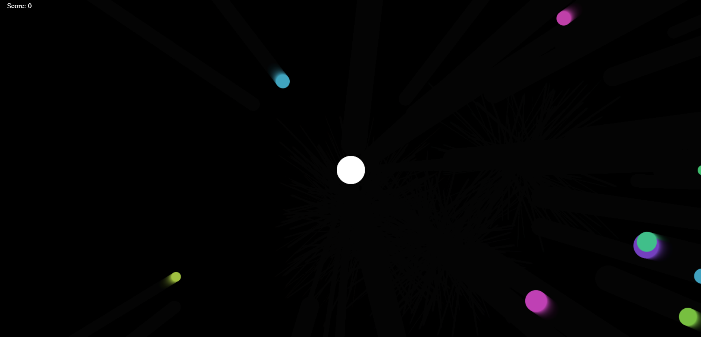
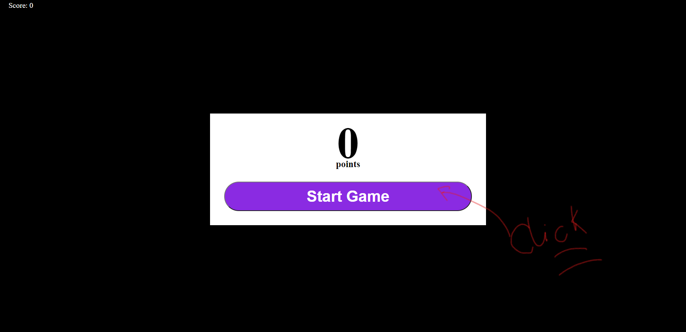
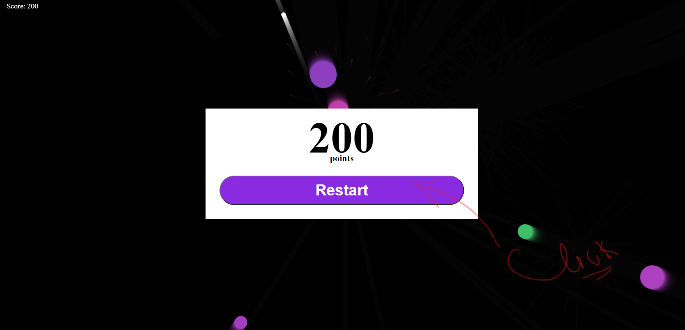

<u><h1 align="center" >Touch and hit</h1></u>

<u><h1 align="center">Description:</h1></u>

## It's a 2D game implemented using canvas API and vanilla JS. This game has firework effects in tye UI.

## It's has random generated colored enemy-objects comming towards the player object with random sizes.

## In the game scores are given by number of enemy you could shoot partially or fully.

## The game gets over once the enemy hits with the player.

## Link: https://touchandhit.netlify.app/

<u><h1 align="center">How To play:</h1></u>

## Press the Start-Button to Start the Game.

## Click the enemy-direction comming towards the centered player to brust the enemy.

## Once the enemy hits the player the game stops and the score is shown!!! So Just press Restart to play Again!!

<u><h1 align="center">Contributions:</h1></u>

## Make it mobile and ipad responsive

## Create Levels for game

## generate a multi-player Mode.

## Contact: shounmaydarsh131@gmail.com
